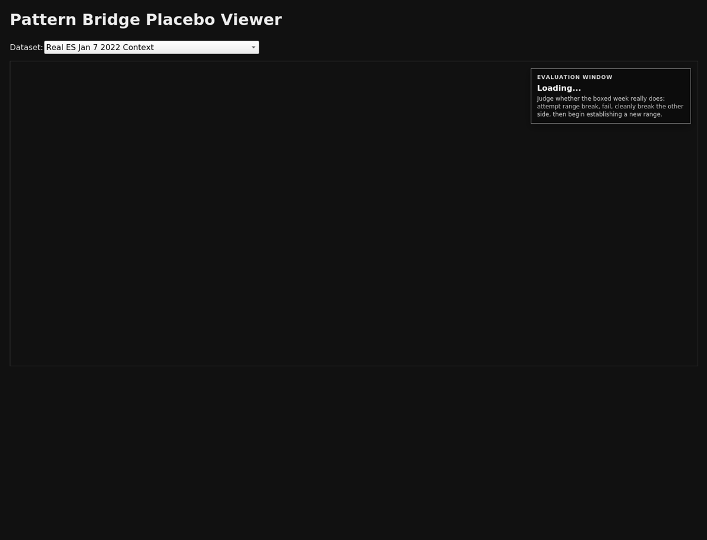

# Pattern Bridge

Pattern Bridge is a futures-market research project for **rare weekly structural analogs**.

## What it is

Pattern Bridge models a specific weekly family:
1. a market attempts to break a prior well-defined multi-week range
2. that break fails, ideally with weak-auction quality like **PTPOH** or **PTPOL**
3. the market cleanly breaks the opposite side of the range
4. the stronger version then begins establishing a **new range** instead of simply continuing to trend

The canonical anchor week is:
- **ES, week ending 2022-01-07**

## Current conclusion

This family appears to be **real, rare, and structurally specific**.

The hard part is not finding reversal weeks.
The hard part is finding the subset that then **settles into a new range**.

## Markets explored so far

Scanned so far:
- ES
- CL
- BP
- FV
- JY
- NQ
- EU
- GC
- US
- TY

Current strongest hits under the sequence-aware scan:
- **ES:** `2016-11-11`
- **CL:** `2011-05-06`

Secondary exploratory markets worth later review:
- **BP**
- **FV**

## Working rules

- use **30-minute futures data**
- treat **ES** as the anchor market
- treat **FOMC** and **NFP** as catalysts, not core selection logic
- compare weeks by **structure, sequence, and range-establishment**, not by news labels alone

## Main docs

- `docs/weekly-meta-playbook-2022-01-07.md`
- `docs/placebo-week-validation-framework.md`
- `docs/full-history-structural-scan-2026-04-11.md`
- `docs/README.md`
